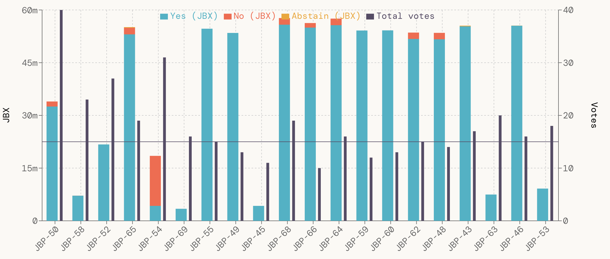

# juice-snapshot-dashboard

📊 Visualize [Juicebox DAO](https://juicebox.money) proposals from [Snapshot](https://snapshot.org/#/jbdao.eth).

👉 https://jbx-protocol.github.io/juice-snapshot-dashboard

## Overview

This project is experimental and WIP. Currently, we only visualize active Snapshot proposals for [Juicebox DAO](https://juicebox.money/#/p/juicebox).

Anyone can contribute to this project!

## Development

In the project directory, you can run:

### `npm start`

Runs the app in the development mode.\
Open [http://localhost:3000](http://localhost:3000) to view it in the browser.

The page will reload if you make edits.\
You will also see any lint errors in the console.
